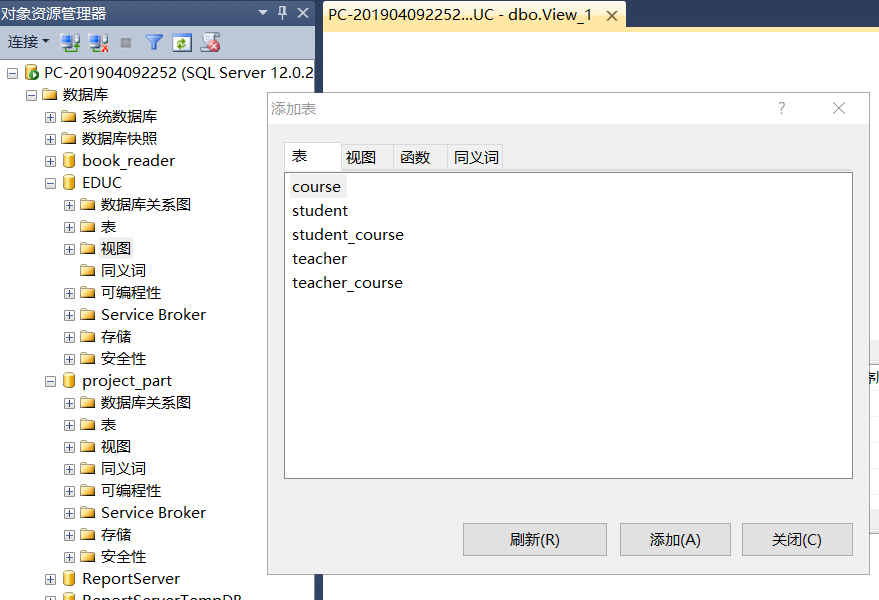
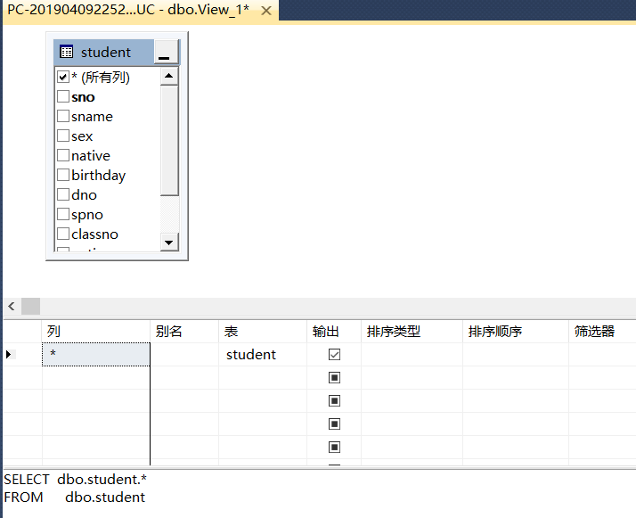
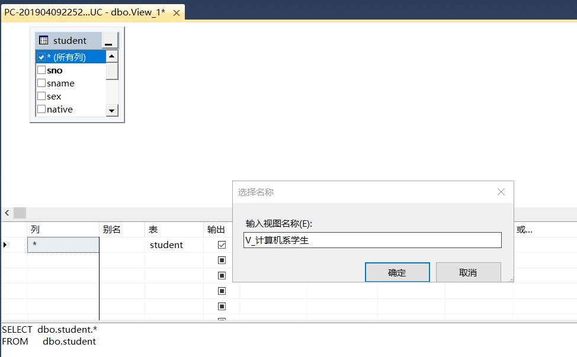
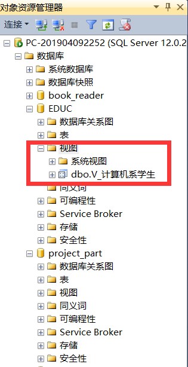
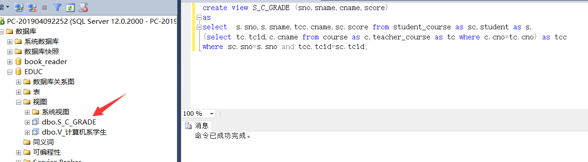
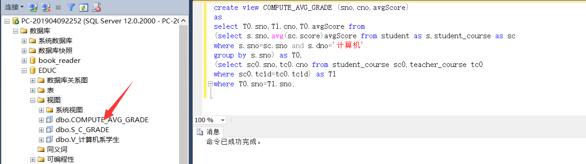

<center><h2>数据库原理课程设计[2-3-4]</h2></center>	
<center><h3>目录</h3></center>
<br>

[TOC]

# 实验七 简单SELECT语句

## 一、实验前置

对实验四所建立表项补充数据后，结果如下:


<center>图7-1 student表</center>


<center>图7-2 course表</center>


<center>图7-3 student_course表</center>


<center>图7-4 teacher表</center>


<center>图7-5 teacher_course表</center>
## 二、实验内容

### 1.简单查询操作

对EDUC数据库实现以下查询：

**(1)  求计算机系的学生学号和姓名**

```mssql
select sno,sname from student where dno='计算机';
--待查字段均在一张表内 使用where字句限定系类型为计算机即可
```


**(2)求选修了课程的学生学号**

```mssql
select distinct sno from student_course;
--查询学生选课表 并对查询得到的学生学号去重即可
```


**(3)求选修C1 课程的学生学号和成绩并要求对查询结果按成绩的降序排列，如果成绩相同则按学号的升序排列。**

```mssql
--此处及以后，我们均令C1课程取为tcid=50101的课程
--完美对应了简单select、联表主从select、in主从select以及聚合查询中的各项题目要求
select sno,score from student_course where tcid=50101 
order by score DESC,sno ASC;
--where条件限定课程，用order by对结果进行排序，需注意的是排序时默认是ASC，需要降序时必须指定DESC。而order by后字段顺序决定了排序属性的主次关系。主关键字相同才会按照从关键字排序。
```


**(4) 求选修课程C1 且成绩在80－90 之间的学生学号和成绩，并将成绩乘以系数0.75 输出。**

```mssql
select sno,score,score*0.75 as s75 from student_course 
where tcid=50101 and score>=80 and score <=90;
--利用where限制条件 限定选修课程为C1且分数在80~90之间
--再选出学号、成绩，并对成绩乘以0.75 为这个新属性起别名为"s75"
```


**(5)求计算机系和数学系的姓张的学生的信息。**

```mssql
select * from student 
where sname like '张%' and (dno='计算机' or dno='数学系');
--将条件分为两部分:限定姓与限定系
--限定姓张 自然想到字符模式匹配 使用like匹配名字属性下以"张"开头的
--限定计算机系和数学系 只需要用或关系即可
--系与姓的限制条件是同时满足 因而二者是与的关系
```


**(6)求缺少了成绩的学生的学号和课程号。**

```mssql
select sno,tcid from student_course where score is null;
--在student_course表中，score是tinyint，若录入时没有录入成绩应为null
--此处排除了0的可能 因为实际应用中 存在学生被记0分的情况
--判断是否为null应该用is null 而非=null
--这是因为null表示不可知不确定，null不与任何值相等（包括其本身）
```


###  2.连接查询操作

**(1)查询每个学生的情况以及他（她）所选修的课程。**

```mssql
select * from student as s,student_course as sc 
where s.sno=sc.sno;
--如果我们不考虑列出课程名 而仅仅列出授课号(tcid)和全部学生信息的话
--这是一个并不复杂的连表 如果要列出课程名 则语句与下一题目重复
--我们先确定需要的数据 全部的学生信息(student表) 学生选修课程的关系(student_course) 
--使用内联表的方式，将两张表做笛卡儿积，然后利用where限定条件限连接条件
--即只保留笛卡儿积后两张表sno相等的部分。
--结果共69条(图未列全)因为存在某学生选修多门课情况 但结果数同student_course保持一致
```


**(2)求学生的学号、姓名、选修的课程名及成绩。**

```mssql
select S.sno,S.sname,TC.cname,SC.score from student S,student_course SC,
(select tcid,cname from teacher_course T,course C1 where T.cno=C1.cno) AS TC
where S.sno=SC.sno and TC.tcid=SC.tcid; 
--这是一个相对复杂了一些的连表查询
--先确定需要的数据 学生学号、姓名(student表) 选修的课程名(course表)
--课程成绩(student_course)
--但course表无法直接同student_course表建立关联 course表中主键为cno
--而student_course中为tcid，tcid和cno的对应关系则保存在teacher_course
--(1)先取最麻烦的课程名，建立一张课程名同tcid的对应关系表TC
--通过连表teacher_course与course 以cno作为约束条件可完成
--(2)将student表(S) student_course表(SC) TC表三者连表
--通过sno约束S与SC的记录 通过tcid约束TC和SC的记录，从而完成连表数据的约束。
--共69条记录 (完全版如下) 以后如无全列出的必要只列出一份图 
```

.png)

.png)

.png)


**(3)求选修C1 课程且成绩在90 分以上的学生学号、姓名及成绩。**

```mssql
select SC.sno,S.sname,SC.score 
from student_course SC,student S 
where SC.tcid=50101 and SC.score>=90 and SC.sno=S.sno;
--一个简单的连表查询
--需要数据中因为还包含了学生姓名，因此必须将student
--与student_course进行连表
--利用两表的sno约束笛卡儿积结果
--限定条件作用在student_course上 
```


**(4)查询每一门课的间接先行课。**

```mssql
select A1.cname as FirstC,A2.cname as SecondC from 
(select C.cname,C.ctno,TC.schoolyear from teacher_course TC,course C where TC.cno=C.cno) AS A1,
(select C.cname,C.ctno,TC.schoolyear from teacher_course TC,course C where TC.cno=C.cno) AS A2
where A1.ctno = A2.ctno and A1.schoolyear < A2.schoolyear;

--间解先行课 此处理解为同一专业第一学年的课程 作为第二学年的间接先行课。
--我们将先行课记为FirstC,另一门对应的课程记为SecondC
--此处以课程名(course表中)来列出课程;
--课程的开课学年信息保存在teacher_course中;
--专业类型用课程类型号ctno来区分;
-- 因此需要连表teacher_course和course
--得到课程名、课程类型号、开课学年三者的对应表(利用cno约束笛卡儿积)A
--要对A表自身的若干字段进行比较 进而筛选记录 因此对A表做自身笛卡儿积
--我们令A表分别记为A1和A2 将A1 A2连表后用ctno约束笛卡儿积得到同专业的课程表
--然后筛选出A1中开课早于A2的记录 
--得到先行课关系表后 为两列重新命名为FirstC SecondC
```


```mssql
--此处记录一项实验反思:
--在设计课程名时，并为考虑到先行的问题 因而使得同一专业的两门课程仅仅在专业类别上相同
--但在实际意义上缺少"先行"关系 在以后设计数据时应该引起警惕。
```

# 实验八 使用子句的SELECT语句

## 一、实验前置

### 1.EDUC数据库

仍沿用上节实验补充数据后的数据库

### 2.图书_读者数据库

#### **(1) 建立库表**

表结构如下：

图书：

| 列名   | 类型  | 长度 | 是否可为空 |
| ------ | ----- | ---- | ---------- |
| 书号   | char  | 10   |            |
| 类别   | char  | 12   | 是         |
| 出版社 | char  | 50   |            |
| 作者   | char  | 20   | 是         |
| 书名   | char  | 50   |            |
| 定价   | money | 8    | 是         |

读者：

| 列名 | 类型 | 长度 | 是否可为空 |
| ---- | ---- | ---- | ---------- |
| 编号 | char | 10   |            |
| 姓名 | char | 8    |            |
| 单位 | char | 50   | 是         |
| 性别 | char | 2    | 是         |
| 电话 | char | 15   | 是         |

借阅：

| 列名     | 类型     | 长度 | 是否可为空 |
| -------- | -------- | ---- | ---------- |
| 串号     | char     | 10   |            |
| 书号     | char     | 10   |            |
| 读者编号 | char     | 10   |            |
| 借阅日期 | datetime | 8    |            |

**要求：**

①图书表：书号为主码

②读者表：编号为主码；

性别只能是“男”或“女”的CHECK 约束

③借阅表：串号为主码；

书号为外码，参照表、列是图书表的书号列；

读者编号为外码，参照表、列是读者表的编号列；

书号和读者编号的联合UNIQUE 约束

```mssql
create database book_reader;  --首先建立数据库
--按照要求建立各表 
--字段命名遵照表名字母缩写+英文译意; 外键同对应约束名
create table bookList(				--图书表
bno char(10) PRIMARY KEY NOT NULL,	--书号
 btype char(12) ,
 bpublish char(50) NOT NULL,
bauthor   char(20),
bname   char(50) NOT NULL,
bprice   money 
);

create table readerList(		--读者表
rno char(10) PRIMARY KEY NOT NULL,
rname char(8) NOT NULL,
rplace char(50),
rsex char(2) check(rsex='男' or rsex='女'),	--性别 具有check约束
rtel char(15)
);

create table borrowList(		--借阅表
brno char(10) PRIMARY kEY NOT NULL, --串号
bno char(10)  NOT NULL,
rno char(10) NOT NULL,
brdate datetime NOT NULL,
foreign key(bno) references bookList(bno),  -- 书号 参照为图书表书号 外键 
foreign key(rno) references readerList(rno),--读者编号 参照为读者表的读者编号 外键
CONSTRAINT reader_book UNIQUE (bno,rno)  --为书号和读者编号建立联合UNIQUE约束reader_book
);
```


#### (2)录入数据

**实验数据：**

**图书：**

| 书号 | 类别   | 出版社             | 作者    | 书名       | 定价 |
| ---- | ------ | ------------------ | ------- | ---------- | ---- |
| 1001 | 计算机 | 机械工业出版社     | 王民    | 数据结构   | 80   |
| 1002 | 计算机 | 机械工业出版社     | 张建平  | 计算机应用 | 20   |
| 1003 | 计算机 | 电子工业出版社     | 王敏    | 数据库技术 | 15   |
| 1004 | 计算机 | 电子工业出版社     | 谭浩强  | C 语言     | 25   |
| 1005 | 英语   | 中国人民大学出版社 | 张锦芯  | 应用文写作 | 25   |
| 1006 | 管理   | 高等教育出版社     | Robison | 管理学     | 15   |
| 1007 | 管理   | 机械工业出版社     | Fayol   | 工业管理   | 70   |
| 1008 | 数学   | 机械工业出版社     | 李平    | 线性代数   | 50   |
| 1009 | 管理   | 机械工业出版社     | Durark  | 公司的概念 | 14   |
| 1010 | 数学   | 机械工业出版社     | 徐新国  | 统计学     | 15   |

**读者：**

| 编号 | 姓名 | 单位         | 性别 | 电话     |
| ---- | ---- | ------------ | ---- | -------- |
| 1001 | 丁一 | 数学院       | 男   | 81234567 |
| 1002 | 赵二 | 经济学院     | 男   | 82234567 |
| 1003 | 张三 | 管理学院     | 女   | 83234567 |
| 1004 | 李四 | 文学院       | 男   | 84234567 |
| 1005 | 王五 | 历史文化学院 | 女   | 85234567 |
| 1006 | 孙六 | 物理学院     | 男   | 86234567 |
| 1007 | 周七 | 生命科学院   | 女   | 87234567 |
| 1008 | 徐八 | 化学院       | 男   | 88234567 |
| 1009 | 宋九 | 信息学院     | 女   | 89234567 |
| 1010 | 刘十 | 计算机学院   | 女   | 80234567 |

**借阅：**

| 串号 | 书号 | 读者编号 | 借阅日期  |
| ---- | ---- | -------- | --------- |
| 01   | 1001 | 1003     | 2000-1-1  |
| 02   | 1002 | 1005     | 2002-3-5  |
| 03   | 1003 | 1008     | 1998-6-18 |
| 04   | 1004 | 1003     | 1997-12-8 |
| 05   | 1005 | 1010     | 2001-5-4  |
| 06   | 1006 | 1001     | 2005-7-25 |
| 07   | 1007 | 1010     | 1997-11-3 |
| 08   | 1008 | 1009     | 2004-2-1  |
| 09   | 1009 | 1004     | 1996-9-1  |
| 10   | 1010 | 1008     | 2000-6-4  |

```mssql
--此处录入实验数据 
--首先将数据快速复制到excel中，适当调整部分数据格式后 转为csv文件(每张表对应一个csv)
--我们采用了"右键数据库"->"任务"->"导入数据"
--在导入选项卡中选择"平面文件"后 选择csv文件的路径
--选择要和csv文件对应的数据库表后 预览查看是否有错漏格式
--查验无误后点击多次 "下一步"和"完成"
--如此 录入另外两张表 此后导入数据若采用导入csv文件方式则不再加以赘述
--采用csv文件导入数据 快捷、高效 也是面向大多应用场景下的信息录入方式
--导入后 结果如下图:
```

.png)

.png)

.png)

## 二、实验内容

### 1.在EDUC中实现如下查询

**(1)求学生总人数**

```mssql
select COUNT(*) as stuCount 
from student;
--从student表中选出全部学生的记录后，
--用count(*)统计记录的数量 作为学生人数
```


**(2)求选修了课程的学生人数**

```mssql
select COUNT(distinct sno) as SCCount 
from student_course;
--从student_course表中选出全部选课的记录后
--对学生编号去重 利用count()统计记录的数量 作为选课人数
```


**(3) 求课程的课程号和选修该课程的人数**

```mssql
select tcid,COUNT(*) as num 
from student_course 
group by tcid;
--从student_course表中取出记录后
--按照授课号进行分组后 对每一个分组统计记录数 作为选修课程人数
```


**(4)求选修课超过3 门课的学生学号**

```mssql
select sno from student_course 
group by sno 
having COUNT(*)>3;
--从student_course表中取出记录后
--按照学生编号进行分组 得到每个学生选课情况
--利用having子句进一步筛出每个分组中超过三条记录的 再取出其学生编号
--此处条件筛选不能用where字句 因为where中不能使用聚合函数
```


### 2.在图书_读者中实现如下查询

**(1)查找这样的图书类别：要求类别中最高的图书定价不低于全部按类别分组的图书的平均定价的2 倍。**

```mssql
select btype from bookList 
group by btype 
having MAX(bprice) >= 2*AVG(bprice);
--从图书表中选取数据
--题目欲求图书类别 此后提出了对图书类别的限定
--很自然地想到对图书类别进行分组 采用having设置限定条件
--按照图书类别分组 每个类别分组下就包含了本类各图书的价格信息
--采用MAX选取本类别最高的图书定价 采用AVG求取本类图书均价
--不低于即大于等于
--列出由having筛选得到符合题目的分组
```


**(2)求机械工业出版社出版的各类图书的平均定价，分别用GROUP BY 和GROUP BY ALL表示。**

```mssql
select btype, avg(bprice) as avg_price 
from bookList where bpublish='机械工业出版社' 
group by btype;
-- group by all
select btype, avg(bprice) as avg_price 
from bookList where bpublish='机械工业出版社' 
group by all btype;
--从图书表中查找数据
--where语句限定出版社为"机械工业出版社"的书目
--对上述书目按照类别分组 并用avg计算出每组的均价
--group by是对where限定后的数据进行分组
--group by all是先列出所有分组，再令不符合where条件的分组其(除了分组字段)各字段为NULL
```


**(3) 列出计算机类图书的书号、名称及价格，最后求出册数和总价格。**

```mssql
select bno,bname,bprice from bookList where btype='计算机';
--where限定为计算机类后 从图书表中取出对应信息
select COUNT(*) as num_book,SUM(bprice)as sum_price 
from bookList where btype='计算机';
--where限定为计算机类后
--统计冲图书表中取出的记录数目作为册数num_book
--对计算机类图书记录的价格用sum进行求和作为总价格sum_price
```


**(4)列出计算机类图书的书号、名称及价格，并求出各出版社这类书的总价格，最后求出全部册数和总价格。**

```mssql
select bno,bname,bprice 
from bookList where btype='计算机';
--where限定为计算机类后 从图书表中取出对应信息
select bpublish,SUM(bprice)as sum_price 
from bookList where btype='计算机' 
group by bpublish;
--where限定为计算机类后
--对图书表中计算机书籍按照出版社进行group by分组
--sum统计每个出版社 计算机类书的总价格
select COUNT(*) as num_book,SUM(bprice)as sum_price 
from bookList where btype='计算机';
--where限定为计算机类后
--count(*)统计冲图书表中取出的记录数目作为册数num_book
--对计算机类图书记录的价格用sum进行求和作为总价格sum_price
```


**(5)查询计算机类和机械工业出版社出版的图书。**

```mssql
select * from bookList where btype='计算机' 
select * from bookList where bpublish='机械工业出版社';
select * from bookList where btype='计算机' and bpublish='机械工业出版社';
select * from bookList where btype='计算机' or bpublish='机械工业出版社';
--此处题目理解上存在歧义:
--(1)分别列为两个查询
--(2)列为一个查询 两个条件是同时成立 and
--(3)列为一个查询 两个条件成立任一个 or
```


# 实验九 子查询

## 一、实验前置

### 1.EDUC数据库

仍沿用上节实验补充数据后的数据库

### 2.工程-零件数据库

#### (1)建立数据库与表

表结构如下：

供应商（S）：

| 列名       | 类型 | 长度 | 是否可为空 |
| ---------- | ---- | ---- | ---------- |
| 供应商代码 | Char | 5    | 否         |
| 姓名       | Char | 50   |            |
| 所在城市   | Char | 20   |            |
| 联系电话   | Char | 20   |            |

工程（J）：

| 列名     | 类型 | 长度 | 是否可为空 |
| -------- | ---- | ---- | ---------- |
| 工程代码 | Char | 5    | 否         |
| 工程名   | Char | 50   |            |
| 负责人   | Char | 10   |            |
| 预算     | Char | 8    |            |

零件（P）：

| 列名     | 类型 | 长度 | 是否可为空 |
| -------- | ---- | ---- | ---------- |
| 零件代码 | Char | 5    | 否         |
| 零件名   | Char | 50   |            |
| 规格     | Char | 10   |            |
| 产地     | Char | 20   |            |
| 颜色     | Char | 10   |            |

供应零件（SPJ）：

| 列名       | 类型 | 长度 | 是否可为空 |
| ---------- | ---- | ---- | ---------- |
| 供应商代码 | Char | 5    | 否         |
| 工程代码   | Char | 5    | 否         |
| 零件代码   | Char | 5    | 否         |
| 数量       | Int  | 4    |            |

**要求：**

①供应商表：供应商代码为主码

②工程表：工程代码为主码

③零件表：零件代码为主码

④供应零件表：供应商代码、工程代码、零件代码为联合主码；

供应商代码为外码，参照表、列是供应商表的供应商代码列；

工程代码为外码，参照表、列是工程表的工程代码列；

零件代码为外码，参照表、列是零件表的零件代码列

```mssql
create database project_part;		 --首先建立数据库
--按照要求建立各表 
--字段命名遵照表名字母缩写+英文译意; 外键同对应约束名
create table STable					--供应商表
(
sno char(5) PRIMARY KEY NOT NULL,	--供应商代码
sname char(50) NOT NULL, 			--姓名
scity char(20),						--所在城市
stel char(20)						--联系电话
);
create table JTable 				--工程表
(
jno char(5)  PRIMARY KEY NOT NULL,	--工程代码
jname  char(50),					--工程名
jleader char(10),					--工程负责人
jbudget char(8) 					--工程预算
);

create table PTable 				--零件表
(
pno char(5) PRIMARY KEY NOT NULL,	--零件代码
pname char(50),						--零件名
psize char(10),						--规格
pplace char(20),					--产地
pcolor char(10)						--颜色
);

create table SPJTable				--供应零件表
(
sno char(5) NOT NULL,				--供应商代码
jno char(5) NOT NULL,				--工程代码
pno char(5) NOT NULL,				--零件代码
num int,							--数量
PRIMARY KEY(sno,jno,pno),			--复合主键
foreign key(sno) references STable(sno),	--参照为供应商表供应商代码 外键
foreign key(jno) references JTable(jno),	--参照为工程表工程代码 外键
foreign key(pno) references PTable(pno)		--参照为零件表零件代码 外键
);
```


#### (2)导入实验数据

供应商： 

| 供应商代码 | 姓名        | 所在城市 | 联系电话   |
| ---------- | ----------- | -------- | ---------- |
| S1         | 北京供应商  | 北京     | 0108888888 |
| S2         | 天津供应商  | 天津     | 0228888888 |
| S3         | 重庆供应商  | 重庆     | 0238888888 |
| S4         | 上海供应商1 | 上海     | 0218888888 |
| S5         | 广州供应商  | 广州     | 0208888888 |
| S6         | 上海供应商2 | 上海     | 0216666666 |

工程：

| 工程代码 | 工程名 | 负责人 | 预算   |
| -------- | ------ | ------ | ------ |
| J1       | 工程1  | 丁一   | 200000 |
| J2       | 工程2  | 赵二   | 60000  |
| J3       | 工程3  | 张三   | 70000  |
| J4       | 工程4  | 李四   | 80000  |
| J5       | 工程5  | 王五   | 150000 |

零件：

| 零件代码 | 零件名 | 规格 | 产地 | 颜色 |
| -------- | ------ | ---- | ---- | ---- |
| P1       | 螺丝   | 中   | 济南 | 红色 |
| P2       | 主板   | 集成 | 深圳 | 绿色 |
| P3       | 显卡   | 独立 | 香港 | 蓝色 |
| P4       | 声卡   | 集成 | 天津 | 红色 |
| P5       | 网卡   | 100M | 上海 | 黑色 |
| P6       | 鼠标   | 无线 | 上海 | 黑色 |

供应零件：

| 供应商代码 | 工程代码 | 零件代码 | 数量 |
| ---------- | -------- | -------- | ---- |
| S1         | J2       | P4       | 50   |
| S1         | J3       | P5       | 100  |
| S2         | J2       | P6       | 500  |
| S4         | J1       | P3       | 150  |
| S4         | J5       | P1       | 200  |
| S5         | J4       | P6       | 100  |
| S6         | J4       | P2       | 90   |

```
根据如上数据，经由CSV文件批量导入后,库表内效果如下:
```


## 二、实验内容

### 1.在EDUC中实现以下查询

(1)求选修了高等数学的学生学号和姓名

```mssql
SELECT sno, sname FROM student
WHERE sno IN (
	SELECT sno FROM student_course 
    WHERE tcid IN (
		SELECT tcid FROM teacher_course
		WHERE cno IN (
			SELECT cno FROM course WHERE cname = '高等数学'
		)
	)
);
--采用in实现的主从查询，包含三层子查询。
--"高等数学"是课程名 保存在course表中
--学生选课关系 保存在student_course表中
--学生姓名 保存在student表中
--而course表同student_course无法直接建立联系 需要借助teacher_course表
--(1)在course表中查询到高等数学对应的课程号cno(子查询)
--(2)在teacher_course表中查询该cno号对应的授课号tcid(子查询)
--(3)在student_course表中查询选修该tcid对应课程的学号sno(子查询)
--(4)在student表中找到该sno对应的学生记录 并选出学号和姓名
```


(2)求C1 课程的成绩高于张三的学生学号和成绩

```mssql
SELECT sno, score FROM student_course
WHERE tcid = 50101
	AND score > (
		SELECT score FROM student_course
		WHERE tcid = 50101
			AND sno IN (
				SELECT sno FROM student
				WHERE sname = '张三'
			)
	);
--包含两层子查询
--课程成绩、选课关系均在student_course中 姓名在student中
--(1)在student表中找出姓名为张三的学生的学号(子查询)
--(2)在student_course表中找出张三选修C1课程的成绩(子查询)
--(3)在student_course表中查找比张三C1课程分数高的记录 筛出学号和成绩
```


(3)求其他系中比计算机系某一学生年龄小的学生信息

```mssql
SELECT * FROM student
WHERE dno <> '计算机'
	AND birthday > ANY (
		SELECT birthday FROM student
		WHERE dno = '计算机'
	);
--完全针对 student表 一层子查询
--年龄小 转换到表中出生日期字段 即 出生日期要大一些
--比某一小 意味着出生日期比某一大 即(起码)大于最小值
--(1)筛选出student表中计算机学生的出生日期 作为子集（子查询）
--(2)筛选出student表中非计算机系的学生 
--(3)同时找出其中 出生日期大于子集中的最小值的记录(因此用的是ANY)
--ANY的效果： 大于最小值 或 小于最大值
```


(4)求其他系中比计算机系学生年龄都小的学生信息

```mssql
SELECT * FROM student
WHERE dno <> '计算机'
	AND birthday > ALL (
		SELECT birthday FROM student
		WHERE dno = '计算机'
	);
--完全针对 student表 一层子查询
--年龄小 转换到表中出生日期字段 即 出生日期要大一些
--都小 意味着 出生日期都大 即大于子查询最大值
--(1)筛选出student表中计算机学生的出生日期 作为子集（子查询）
--(2)筛选出student表中非计算机系的学生 
--(3)同时找出其中 出生日期大于子集中的最大值的记录(因此用的是ANY)
--ALL的效果： 大于最大值 或 小于最小值
```


(5)求选修了C2 课程的学生姓名

```mssql
SELECT sname FROM student
WHERE sno IN (
	SELECT sno FROM student_course
	WHERE tcid = 50110
);
--此处 令C2课程为tcid=50110的课程 此后同理
--包含一层子查询
--课程成绩、选课关系均在student_course中 姓名在student中
--(1)从student_course中找到选修了C2课程的学生学号(子查询)
--(2)从student中找到对应学号的记录 并筛出姓名
```


(6)求没有选修C2 课程的学生姓名

```mssql
SELECT sname FROM student
WHERE sno NOT IN (
	SELECT sno FROM student_course
	WHERE tcid = 50110
);
--为(5)题的逆过程 在IN前加否定词即可
```


(7)查询选修了全部课程的学生的姓名

```mssql
SELECT sname FROM student
WHERE sno IN (
	SELECT sno FROM student_course
	GROUP BY sno
	HAVING count(*) = (
		SELECT count(*) FROM course
	)
);
--用到聚合分组的两层子查询
--选修全部课程，思路为：选修课程数达到课程总数的学生
--此处认为 有的学生 跨学科 跨年纪选修课程
--(1)对course表求记录总数 作为课程总数   (子查询)
--(2)对student_course表按照学号进行分组 (子查询)
--   使用count(*)统计出每位学生的选课数
--   使用having子句筛选出学生选课数与课程总数相同的记录
--   列出对应学生的学号
--(3)在student表中找出对应学号的记录 并列出其姓名
```


(8)求至少选修了学号为“S2”的学生所选修的全部课程的学生学号和姓名

```mssql
SELECT sno, sname FROM student s1
WHERE NOT EXISTS (
	(SELECT tcid 
     FROM student_course
	 WHERE sno = '2019118')
    
	EXCEPT
    
	(SELECT tcid
     FROM student_course sc, student s2
	 WHERE sc.sno = s2.sno		
	   AND s1.sname = s2.sname
	   AND sc.sno <> '2019118')
);
--完成这一查询 需要用EXCEPT来配合EXISTS
--对于 A EXCEPT B 类似于 A-(A交B) 留下的是A中不属于B的记录
--对于 EXISTS 遍历主语句的查询表 若子查询有记录则返回True 
--           保留对应的记录 反之返回False 不保留
--而NOT EXISTS则是子查询为空则保留记录 
--我们得到一个显然的思路：
--(1)遍历student中的每个学生 记为stu1
--(2)将用于比较的学生stu0的选课表 同stu1学生的选课表 进行EXCEPT运算
--(3)若得到空集(即stu0学生选修课全在stu1的选课表中)
--	 保留该生的记录
--(4)最后将stu0学生的记录去掉 剩余学生的sno,sname 即为所求
```


### 2.在工程-零件数据库实现以下查询

(1)求供应项目j4红色零件的供应商号及名称

```mssql
SELECT sno, sname FROM STable
WHERE sno IN (
	SELECT sno FROM SPJTable
	WHERE jno = 'J4'
		AND pno IN (
			SELECT pno FROM PTable
			WHERE pcolor = '红色'
		)
);
--采用in实现的主从查询，包含两层子查询。
--颜色信息在零件表 供应商号在供应商表 
--而供应关系在零件供应表
--(1)先从零件表中取出红色零件的零件编号(子查询)
--(2)再从零件供应表中取出供应给J4项目
--   且零件编号在上述编号集的记录 返回其供应商编号
--(3)根据供应商编号在供应商表中找到对应记录 筛出编号和名称

```


```mssql
--实际查询时发现 给项目J4供应的零件只有P2和P6 分别为绿色和黑色
```

(2)求没有上海供应商生成的零件的项目号

```mssql
SELECT jno FROM JTable
EXCEPT
(SELECT distinct jno FROM SPJTable
	WHERE sno IN (
		SELECT sno FROM STable
		WHERE scity = '上海'
	)
 );
 
--包含一个子查询关系 和一个集合的差 关系
--"上海"(所在城市)在供应商表中 供应关系在零件供应表
--项目编号在项目表中可差 也可以在零件供应表查询后distinct
--(1)从项目表中筛出全部项目的编号
--(2)从供应商表中找出上海供应商对应的供应商编号(子查询)
--   从零件供应表中找到由该供应商供货的项目编号 并去重
--(3)由(1)的结果 减去 (2)的结果 
```


(3)至少使用了供应商S5所供应全部零件的项目号

```mssql
--至少使用了供应商S5所供应全部零件的项目号
SELECT jno
FROM JTable T0		--遍历比较
WHERE NOT EXISTS (		--结果为空时保留记录
	(SELECT DISTINCT pno
	FROM SPJTable
	WHERE sno = 'S5')	--S5供应的全部零件
	EXCEPT
	(SELECT DISTINCT pno
	FROM SPJTable T1
	WHERE T0.jno = T1.jno) --每个项目采用的全部零件
);
```


# 实验十 创建视图

## 一、实验前置

### 1.EDUC数据库

上一次实验中创建好的数据库EDUC。

## 二、实验内容

### 1.创建视图

#### (1) 使用对象资源管理器

**在EDUC库中以“student”表为基础，建立一个名为“V_计算机系学生”的视图。在使用该视图时，将显示“student”表中的所有字段.**

```
 在“对象资源管理器”窗口中找到EDUC数据库,在“视图”项上单击鼠标右键，在弹出的子菜单中选择“新建视图”命令后，弹出“添加表”对话框，如下图所示：
```



```
选择"student"表后，点击“添加”按钮，点击“关闭”按钮。在"视图设计器窗口"的"关系图窗格"中出现了student表。我们勾选所有列后，可以在"显示条件窗格"中看到列中加入了"*"(表示全部)，在“显示SQL窗格”中还可以看到对应的SQL语句。如下图:
```



```
按下Ctrl+S对设计好的视图进行保存，在弹出的“选择名称”对话框输入"V_计算机系学生",点击确定按钮保存即可。
```



```
关闭视图设计窗口，在"对象资源管理器"的EDUC下的"视图"项上单击鼠标右键，按下"刷新"。即可在视图项下看到刚刚创建的视图"V_计算机系学生"。
```




#### (2) 使用SQL语句

 **在查询分析器中建立一个每个学生的学号、姓名、选修的课名及成绩的视图S_C_GRADE；**

```sql
--新建查询后，输入如下sql语句
create view S_C_GRADE (sno,sname,cname,score)
as
select  s.sno,s.sname,tcc.cname,sc.score from student_course as sc,student as s,
(select tc.tcid,c.cname from course as c,teacher_course as tc where c.cno=tc.cno) as tcc
where sc.sno=s.sno and tcc.tcid=sc.tcid;
--使用sql语句创建视图时，其大体结构为 
--create view 视图名([字段1,字段2,....]) as [与字段对应的select语句]
--本例中由于需要课程名，因此需要先联表teacher_course和course得到tcid与cname的对应关系tcc表
--sname需要student获取，选课关系和score需要student_course获取 
--最终联合三表student student_course tcc 获得需要信息，并用where剔除干扰项。
```



 **②建立一个所有计算机系学生的学号、选修课程号以及平均成绩的视图COMPUTE_AVG_GRADE;**

```mssql
create view COMPUTE_AVG_GRADE (sno,cno,avgScore)
as
select T0.sno,T1.cno,T0.avgScore from
(select s.sno,avg(sc.score)avgScore from student as s,student_course as sc 
where s.sno=sc.sno and s.dno='计算机' 
group by s.sno) as T0,
(select sc0.sno,tc0.cno from student_course sc0,teacher_course tc0 
where sc0.tcid=tc0.tcid) as T1
where T0.sno=T1.sno;
--这是一个稍复杂的查表和联合机制
--首先 保存学生选课关系的student_course表中只有教师的上课编号tcid 
--    想获得学生的选修课程号 需要去teacher_course中根据tcid联表查询得到cno
--因此我们得到了sno_cno的对应关系表T1
--其次 要对student表和student_course表进行联合查询 才能筛选出计算机系学生选课情况
--     再使用对sno字段的分组，用avg求得每个学生的课程均分
--因此我们得到了sno_avgScore的对应关系表T0
--最后，对T0和T1进行联合查表 利用sno作为联合字段 筛选得到最终结果
--需要注意的是 每个学生可能选修了多门课程 因而记录中会包含重复的sno_avgScore(但cno不同)的情况。
```



```mssql
--但很快发现,这样创建得到的视图过于复杂，其后使用对象资源管理器修改视图时存在一系列问题
--若我们将选修课程号看作教师的上课编号后 问题得以合理化
--删除上面建立的视图后 重新建立
create view COMPUTE_AVG_GRADE (sno,tcid,avgScore)
as
select S.sno,Sc.tcid,avg(Sc.score)
from student S,student_course SC
where S.sno=SC.sno and S.dno='计算机'
group by S.sno,Sc.tcid;
```


###  2.修改视图 

#### (1) 使用对象资源管理器

**在对象资源管理器中将视图COMPUTE_AVG_GRADE中改成建立在数学系的学生学号、选修课程号以及平均成绩的视图。**

```
在 “对象资源管理器” 中，然后单击EDUC数据库下 “视图” 项旁边的加号，右键单击要修改的视图COMPUTE_AVG_GRADE，然后选择“设计”。
进入设计视图后，我们在显示条件窗格中找到dno字段，将筛选器修改为“=’数学系后‘”，保存视图。
```


#### (2) 使用SQL语句

**在查询分析器中使用更改视图的命令将上面建立的视图“V_计算机系学生”更名为“V_计算机系男生”。**

```mssql
sp_rename V_计算机系学生,V_计算机男生;
```


### 3.删除视图

#### (1) 使用对象资源管理器

  **用对象资源管理器删除视图“V_计算机系男生”。**

```
 在“对象资源管理器”窗口中找到EDUC数据库,展开“视图”，选中"V_计算机系男生"后单击右键，选择"删除"
```


#### (2) 使用SQL语句

**用SQL语句删除视图COMPUTE_AVG_GRADE。**

```mssql
drop view COMPUTE_AVG_GRADE;
```


# 实验十一 使用视图

## 一、实验前置

## 二、实验内容

### 1.定义视图

在EDUC数据库中，以Student Course 和Student_course 表为基础完成一下视图定义

**(1)定义计算机系学生基本情况视图V_Computer；**

```mssql
CREATE VIEW V_COMPUTER
AS
SELECT * FROM student
WHERE dno='计算机';
```


**(2)将Student Course 和Student_course表中学生的学号，姓名，课程号，课程名，成   绩定义为视图V_S_C_G**

```mssql
CREATE VIEW V_S_C_G
AS
SELECT
student.sno,student.sname,course.cno,course.cname,student_course.score
FROM student,course,student_course,teacher_course
WHERE student.sno=student_course.sno 
  and teacher_course.tcid=student_course.tcid
  and teacher_course.cno=course.cno;
--course无法同student_course直接连表 需要借助teacher_course
```


**(3)将各系学生人数，平均年龄定义为视图V_NUM_AVG**

```mssql
create view V_NUM_AVG(dno,stuNum,avgAge)
AS
select dno,count(*),avg(datediff(year,birthday,GETDATE()))
from student 
group by dno;
--将student表按照dno分组后，统计各组记录数作为人数
--利用datediff函数 取出出生日期和当前日期的year部分 做差求年龄
--对年龄用avg求均值
```


(4)定义一个反映学生出生年份的视图V_YEAR

```mssql
create view V_YEAR(sno,sname,year)
AS
select sno,sname,year(birthday) as year 
from student;
--本题的关键在于采用year()函数 提取出生日期的年份
```


**(5)将各位学生选修课程的门数及平均成绩定义为视图V_AVG_S_G**

```mssql
create view V_AVG_S_G(sno,num,avgScore)
AS
select sno,count(*),avg(score)
from student_course
group by sno;
--将student_course按照学号分组后
--得到每一位同学的选课情况
--count(*)统计每位同学的记录数得到选课数
--avg()对分数求均值
```


**(6)将各门课程的选修人数及平均成绩定义为视图V_AVG_C_G**

```mssql
create view V_AVG_C_G(tcid,num,avgScore)
AS
select tcid,count(*),avg(score)
from student_course
group by tcid;
--将student_course按照授课号分组后
--得到每门课程的选课情况
--count(*)统计每位同学的记录数得到选课数
--avg()对分数求均值
```


### 2.使用视图

```sql
--查询语句中 视图名划红线的原因:
--sqlServer中 新建的视图、表项 若仅仅刷新是无法在输入语句时自动补全的 会划红线
--红线不影响查询的实现(不会报错) 如果关闭数据库重新打开 即可消除（也能自动补全）
```

查询以上所建的视图结果。

.png)

.png)

.png)

.png)

.png)

.png)

**(1)查询平均成绩为90分以上的学生学号、姓名和成绩；**

```mssql
--连表student与视图V_AVG_S_G
select S.sno,sname,avgScore
from student S,V_AVG_S_G V
where S.sno=V.sno and V.avgScore>90;
--V_AVG_S_G中保存着各个学生的平均成绩
--将其与student连表后 利用sno约束笛卡儿积
--限定平均成绩大于90分的结果
```


**(2)查询各课成绩均大于平均成绩的学生学号、姓名、课程和成绩；**

```mssql
select S.sno,S.sname,SC.tcid,SC.score
from V_AVG_C_G V,student_course SC,student S
where V.tcid=SC.tcid and S.sno=SC.sno 
     and SC.score>V.avgScore ;
--各课的平均成绩保存在视图V_AVG_C_G中
--(1)将其与student_course连表 用tcid约束
--   筛选出 student_course中成绩高于本课程平均成绩的记录 返回tcid 成绩
--(2)再将student表加入连表中 用sno同二者构建约束
---  返回对应的学号 姓名
```


**(3)按系统计各系平均成绩在80分以上的人数，结果按降序排列；**

```mssql
select dno,count(*)as num
from V_AVG_S_G V,student S
where S.sno=V.sno and V.avgScore>80
group by dno
order by num DESC;

-- V_AVG_S_G 保存着各学生的平均成绩
--(1)使V_AVG_S_G视图与student连表 用sno约束
--   得到了包含着系信息的学生平均成绩 再筛出平均成绩大于80的
--(2)对上述结果按照系进行分组 分别统计每组的记录数
--(3)按照人数num的降序显示结果
```


### 3.修改视图

```mssql
--此处并未能找到视图V_IS
--实验前后中均未提到关于V_IS视图的建立 
--因此 我们与其字段结构相近的的V_S_C_G视图代替
```

**(1)通过视图V_IS，分别将学号为“S1”和“S4”的学生姓名更改为“S1_MMM”,”S4_MMM” 并查询结果;**

```mssql
--令学号 S1为 学号2019126 ; 学号S4为 学号2019101
update	V_S_C_G 
set	sname='S1_MMM' 
where sno= '2019126';

update	V_S_C_G 
set	sname='S4_MMM' 
where sno= '2020101';

select * from V_S_C_G;
```


**(2)通过视图V_IS，新增加一个学生记录 ('S12','YAN XI',19,'IS')，并查询结果**

```mssql
insert	into	V_S_C_G
values ('S12','YAN XI',19,'IS',null);
--失败了 因为V_S_C_G视图是连用4个基表实现的
--修改该视图会影响多张表 故而报错
```


**(3)要通过视图V_AVG_S_G，将学号为“S1”的平均成绩改为90分，是否可以实现？并说明原因**

```mssql
--不可以实现
update	V_AVG_S_G 
set	avgScore=90
where sno= '2019126';
--执行该语句会发现产生报错
--因为V_AVG_S_G 中包含了诸多派生的聚合字段结果 
--这些聚合字段结果反应到视图中属于常量域 是不可修改的
```


# 实验十二 	更新语句

## 一、实验前置

#### 1.EDUC数据库

采用上一实验中的EDUC库

## 二、实验内容

```mssql
--说明:
--对应专业号和院系号 对应的字段均为spno
--因为在实验要求给出的建表信息中 院系一栏只有一个dno 
--为了直观查询案例 我们将dno作为了院系名 spno作为专业和院系的共用
--本库学生的入学年为2019和2020 分别对应题目中的2006和2007
--(采用2019和2020入学年 是为了避免出现上学年龄过大的问题)
--题目中以"00X"形式出现的值项 在实际查询中均在其前加了一个1
```

**1． 对于student表，将所有专业号为‘001’的，并且入学年份为2006的学生，或是专业号为‘003’，并且年龄小于20岁的学生的班级号改为‘001’。**

```mssql
--请先行阅读说明部分--
update student 
set classno='1001'
where (spno='1001' and year(entime)=2019 ) 
or (spno='1003' and datediff(year,birthday,GETDATE())<20);
--update..set 先设定修改表和修改字段
--加入where语句 限定条件
--条件1中 我们取出入学日期的年份 判断其值是否为2019
--条件2中 我们用datediff计算年龄 筛选小于20的 
--两个条件 我们用or连接
```


**2． 对于student表，删掉所有年龄小于20岁，并且专业号为‘003’的学生的记录。**

```mssql
delete from student 
where spno='1003' 
and datediff(year,birthday,GETDATE())<20;
--delete from 指定要删除内容所在的表名
--where限定删除条件
```


**3． 对于student表，插入一条新记录，它的具体信息为，学号：2007110011、姓名：张三、性别：男、出生日期：19880808、院系编号：‘001’、专业编号:‘001’、班级号：‘001’、入学时间：20070901。**

```mssql
insert into student values
('20071100','张三','男','无','1998-08-08',
'计算机','1001','1001','2007-09-01','无','无');

--在实验四(二)中题目要求中对sno学号字段做出明确规定 限长是8个字符。
--此处与此前实验要求相违背的内容 贴图为证
--此处我们以以8字符长为准
```


<center>实验要求冲突 证明图</center>

**4． 对于student表，将入学时间最晚的学生和年龄最小的学生的联系方式去掉。**

```mssql
update student
set tel=null
where (
birthday=(select max(birthday) from student)
    or
    entime=(select max(entime) from student)
);
--入学最晚只要取最大的入学日期 年龄最小只要取最大的出生日期
--利用update...set... 修改符合条件的记录 令其tel字段为null值
--由于建库时在出生日期和入学日期时考虑到一所学校内学生应该邻近年份出生、入学
--且同一级学生入学年份应相同 
--从而,导致一些记录有相同的出生日期和入学日期
--因此，入学最晚和年龄最小的 是一批学生
```


**5． 对于student表，将平均年龄最小的一个院系的院系编号改为‘008’。**

```mssql
UPDATE student
SET spno = '1008'
WHERE spno IN (
		SELECT TOP 1 spno
		FROM student
		GROUP BY spno
		ORDER BY avg(datediff(year, birthday, GETDATE()))
	);
--通过出生日期来计算年龄的方式为:利用datediff函数 对出生日期和当前日期 在"年份"上做差
--(1)我们先将student表按照院系spno分组 利用聚合平均函数和datediff来计算得到各院的平均年龄 
--	 按照平均年龄对分组后的表进行增序后，我们取出第一条记录的spno
--(2)我们利用in进行子匹配 从而对该spno对应的各条记录进行更新
--上述写法已经经过优化  原先未优化的查询语句可见下附图
```


<center>优化后的思路</center>


<center>未优化时的思路</center>


# 实验总结

本次综合实验，跨度时间较长、涉及内容较多、数据库录入数据工作较为繁重，但总体上收获颇多，特别是对于查询语句有了更深刻的理解，对于数据库软件的使用和操作有了更得心应手的应用。

(1)在数据库的数据录入中，踩坑颇多。初期尝试使用sql语句来录入数据，但很快发现问题:大量数据录入时，数据的编写工作往往是在Excel里基于下载好的真实数据，保留姓名、性别、住址等信息，对其进行编号重排、构造随机数、文本截取拼接的方式来实现。而若将编写好的数据批量地用sql语句完成插入的操作，无疑带来了较大的工作量，最重要的是容易出错。尝试过用python读取excel后自动生成批量的sql语句，但后期的扩展性较差。 结合此前运维内容管理系统的经验，构想能否将excel文件(或者是csv文件)直接导入到数据库对应的表项中。查询资料后发现，SqlServer支持通过"平面文件"的方式来导入csv文件的数据到数据库中。但导入的过程也不是一番风顺的，首先是不同编码问题带来的数据乱码情况。查询网络资料后惊奇地发现，导入平面文件时,csv文件居然不能是utf8格式，必须保持原先的ANSI格式，这一点着实令人费解。此外，在导入时由于excel数据格式和SqlServer的字段格式并不兼容，二者需要完成强制转换。对于文本、数字内容转换效果非常好，但在转日期时出现了报错。最后，通过在EXCEL中对日期文本设置为通用-日期格式后，解决了该问题。掌握了快速导入CSV文件的要领后，此后的数据录入工作效率提高，且几乎不存在录入错误(因为题目中word的数据表格可以无损复制到excel中再保存为csv)。

(2)数据库导入与导出。原先在实验室机器上进行实验时，由于时间跨度较大，无法在一节课中完成全部内容，因而需要分多次完成。但实验室的机器每次都会重置系统，因而需要寻求一种可以能对数据库内容进行快速且无损的导入、导出方式。经过查询资料与数次操作试验后，发现了导入导出数据库的利器"数据库备份"功能。SqlSever可以快速完成对指定数据库的备份，同时也支持对该数据库备份的导入。因此可以避免每次重新导入数据的问题。直接利用.bak文件进行导入导出即可。同时也能在进行不确定操作时先将数据库导出，而后再进行风险操作。养成这一习惯在后期调整数据库时，至关重要。

(3)多次调整数据。数据录入后并非万事大吉。原先的数据是通过阅读实验四与实验七的内容后按照**题目需求**来编写的，数据设计的考量上也仅仅局限在这两项实验中。然而再进行实验八九时发现了更多的问题，因此，对数据内容前后进行了四次调整，每次都是清表后重新导入。最终使得数据内容能够完美覆盖三项实验中的全部查询要求。但好景不长，在进行实验十一、十二时再次发现了数据设计中未覆盖的题目要求，甚至还出现了和此前题目要求相冲突的内容，但数据内容经过数次修改已经积重难返，再次调整变得较为困难和繁琐，因此在实验十二中，我们对实验要求，在不改变其功能本质的情况下，对其做了一些细微的限制操作。在此想对实验四、五的内容提一点建议: 对EDUC数据库的数据录入能否加以诸多限制条件或给出一些示范样例，以尽量避免每做一次实验都需要调整一次数据库。同时对实验题目要求中产生冲突的内容加以剔除。此外，在视图实验11中，出现了一个从未在此前提到过的视图V_IS，根据已有题干并不能完全正确地推导出V_IS的结构，因而使得V_IS相关的实验内容无法顺利展开。

(4)对EXISTS-EXCEPT联合语句得以理解加深。

- 此前对于EXCEPT语句存在错误理解，认为其是执行了A-B的操作，但在进行了数据库实验后，通过实例查询操作辅以查询资料后发现，EXCEPT语句实际上是完成了 A-(A交B)的操作，即A Except B得到的是A中不在B的内容，即A特有的内容。
- 此前对于EXISTS的功能存在片面性地理解，认为where exists(子句) 的效果只有 根据子句查询结果是否为空返回是否为真，若为真则条件成立，反之条件不成立。而NOT EXISTS则与此相反。但由于缺乏实际操作案例，忽视了EXISTS的实际用途。它可以逐条地按照记录中的某个或某几个属性来完成判断筛选，类似于一个For-IF的结构。意味着很多情况下利用EXISTS语句可以简化诸多的查询语句。
- 综合利用上述两项查询语句，可以完成一个复合操作----**"包含"**，若我们要查询包含了某个集合内容的全部记录，则可将 待查询的**包含内容** 同 **记录的内容**做EXCEPT，若返回为空集则表明该记录完美包含了该集合内容，反之则不是。 也就是说我们需要保留EXCEPT为空集的情况，因此选用**NOT EXISTS**。这样的理解是在理论课程上完全无法学习到的，只有通过实际操作才能获得更贴切的理解。

(5)查询神器----视图

此前的学习也好、项目经历也好，从未接触过视图。可以说视图是完完全全在数据库实验课中接触到的内容，初期来看觉得该功能较为鸡肋，不就是对一组查询的结果起了一个"别名"嘛，但跟随着实验内容继续深入，我认识到视图在复杂的查询中可以:

- 简化语句: 我们可以将一个非常复杂的查询语句，利用视图简化为若干的"模块"，再利用通用的语句将这些模块组合起来，以达到少量语句完成复杂查询的效果，得以简化、美化查询语句。
- 提高容错：提高容错的重要思路就是简化与分工。或者说降低耦合性、简化思路。视图完美地符合了这两个特性。将语句简化可以让语句更加清晰，从而便于设计梳理思路。而视图使得查询之间可以按照模块组合的方式，降低每个复杂查询之间的耦合性，从而可以通过对每个视图进行类似于软件工程中的"单元调试"方式，来更快地定位错误、派查错误。