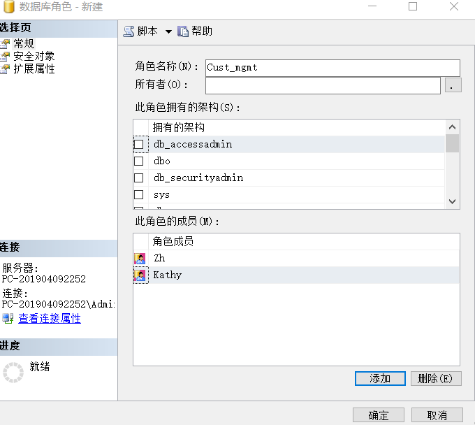

<center><h2>数据库原理课程设计[实验七]</h2></center>	<br>

# 一、实验准备

## 1.数据库准备

数据库操作，均基于此前的EDUC数据库。

## 2.前置知识准备

### 2.1 系统存储过程实现权限管理

(1)为登录newlogin在数据库中添加安全账户newuser

```mssql
EXEC sp_grantdbaccess 'newlogin','newuser'
```

 (2)添加newuser为角色newrole的成员 

```mssql
EXEC sp_addrolemember 'newrole','newuser' 
```

(3)删除当前数据库用户 

```mssql
EXEC sp_revokedbaccess 'newuser'; 
```

(4)删除数据库登录 

```mssql
EXEC sp_droplogin 'newlogin' 
```

(5)删除数据库角色 

```mssql
EXEC sp_droprole 'newrole' 
```

 (6)从数据库角色(newrole)中删除用户(newuser)

```mssql
EXEC sp_droprolemember 'newrole', 'newuser' 
```


### 2.2 SQL脚本实现权限管理

 (1)新建登录名、用户，创建带密码的mylogin登录名，MUST_CHANGE 选项需要用户首次连接服务器时更改此密码。 

```mssql
CREATE LOGIN mylogin WITH PASSWORD = '123456' MUST_CHANGE; 
```

(2)创建mylogin登录名。并将此登录名映射到mycredential凭据。 

```mssql
CREATE LOGIN mylogin WITH PASSWORD = 'password5', 
CREDENTIAL = mycredential; 
```

从Windows 域帐户创建登录名 ：

(3)如果从Windows 域帐户映射登录名，则登录名必须用方括号([ ]) 括起来。 

```mssql
CREATE LOGIN [jack\xiangzhao] FROM WINDOWS; 
```

(4)如果指定用户名，则不使用默认登录名作为该数据库用户 

```mssql
CREATE USER myuser FOR LOGIN mylogin
```

 (5)创建用户myuser拥有的数据库角色myrole

```mssql
CREATE ROLE myrole AUTHORIZATION myuser; 
```

 (6)创建db_role固定数据库角色拥有的数据库角色myrole

```mssql
CREATE ROLE myrole AUTHORIZATION db_role
```


# 二、实验内容

## 1.为用户和角色分配登录帐户

a)	创建登录帐户
登录名：newlogin；密码：super5@kong.com；数据库：educ。

```mssql
EXEC sp_grantdbaccess 'newlogin','super5@kong.com','educ';
```

b)	创建用户:用sp_adduser创建用户newuser,并添加到登录名newlogin 中，注：
如果不指定用户名，则添加到当前数据库登录名中，如果不指定角色，则该用户默认属于public角色。

```mssql
EXEC sp_adduser 'newlogin','newuser';
```

c)	创建角色：用sp_addrole创建角色 newrole

```mssql
EXEC sp_addrole 'newrole';
```

d)	将用户newuser添加到newlogin登录名中，指定其为newrole角色。

```mssql
EXEC sp_adduser 'newlogin','newuser','newrole';
```


## 2.为用户和角色分配许可权限

a)	授予（GRANT）：为角色newrole赋予student表(数据库EDUC中)的选择（SELECT）、更新（UPDATE）所有权限

```mssql
grant select,update on student to newrole;
```

b)	拒绝（DENY）：禁止角色newrole使用student_course表的插入权限

```mssql
deny insert on student_course to newrole;
```

c)	废除回收（revoke）
(使用频率较低 不做考虑)

## 3.管理许可权限

即为服务器和数据库角色分配安全帐户；创建数据库角色；分配语句和对象的许可权限。

**a)创建数据库角色**
为EDUC创建数据库角色Cust_mgmt，用户Zh和Kathy 并添加到Cust_mgmt的成员中。

```shell
#这里 我使用的是SQLServer2014版本
#1.首先，在对象资源管理器中打开EDUC数据库->右击【安全性】->右击【用户】->单击【新建用户】->选择【不带登录名的SQL用户】
#	在弹出界面的用户名处填写好，点击确定完成创建。按此步骤，分别为Zh和 Kathy创建为对应的用户。
#2.在对象资源管理器中打开EDUC数据库->右击【安全性】->双击【角色】->右击【数据库角色】->单击【新建用户】->【角色名称】输入Cust_mgmt。
#3. 在【此角色成员】选项卡下，点击【添加】按钮，在弹出界面的【输入要选择对象名称】中填写"Zh"并回车，可以看到Zh被添加到了Cust_mgmt的成员中。同理添加Kathy。
#4.点击【确定】按钮，完成角色创建与成员添加。
```




**b) 分配语名许可权限**

 Create database/table/procedure/view/ e.g

  运用对象资源管理器分配语句许可权限，给用户Kathy授权，使其能够创建视图和存储过程

打开EDUC->右击->属性（Properties）à选择”权限”（permissinon）->为用户Kathy选择“创建视图”【create view】和过程【create Procedure】和查看表的权限。

执行下列SQL语名来创建视图：

```mssql
USE EDUC
GO 
CREATE VIEW  Myview AS
SELECT  name, sno
From student 
```

回答问题：用户能否完成创建视图的的操作?

```mssql
--答：能，因为已经授予Kathy创建视图与存储过程的权限。
```

执行下列SQL语名来显示学生信息：

```mssql
USE EDUC
GO 
Select *from student
```

回答问题:学生信息能否显示出来？

```mssql
--答:不能，因为没有授予Kathy选择(select)的权限。
```

**c) 分配对象许可权限**

表和视图的许可：select update insert delete

列操作的许可： select  update references

过程的执行许可：  EXEC

**请回答下列问题：**

**(1)如果使用环境中存在从UNIX和winserver 连接进来的用户，那么应该选择哪种认证模式：**

```mssql
--答：因为混合模式既支持Window身份严重，又支持SqlSever的身份认证。所以应当选择混合模式。
```

**(2)如果给ZH用户授予更新表的权限，但该用户所属角色cust_mgmt又拒绝了此权限，那么ZH帐户是否保留更新表的权限？**

```mssql
--答：ZH不能再保留更新表的权限。既然ZH所属角色cust_mgmt拒绝(Deny)了更新表的权限，并且这种拒绝能够取代授权(Grant)的作用，所以不再保留更新表的权限
```

