<center><h2>数据库原理课程设计[实验八]</h2></center>	<br>

# 一、实验准备

某学校要求学生把校园卡与银行卡绑定，学生数据库STUDENT中有两张表，其中校园卡号是学生的学号。

```
Icbc_card(studentcardid,icbcid,balance)

Campus_card(stuentcardid,balance)
```

## 1.建立数据库

```mssql
create database [student] on primary
(name = N'student',FILENAME = N'E:\sql_data\student1.mdf', size=3072KB,
MAXSIZE = UNLIMITED,FILEGROWTH=1024KB )
LOG ON
(name = N'student_log',FILENAME = N'E:\sql_data\student_log1.ldf', size=1024KB,
MAXSIZE = 2048GB,FILEGROWTH=10% )
GO 
```

## 2.建立数据表

```mssql
create table campus_card
(
	studentcardid char(8),
	balance decimal(10,2)
);
create table icbc_card
(
	studentcardid char(8),
	icbcid char(10),
	balance decimal(10,2)
);
```

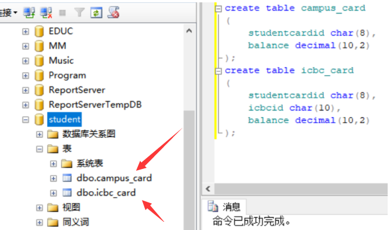

## 3.录入数据

```mssql
insert INTO campus_card values ('20150031',30);
insert INTO campus_card values ('20150032',50);
insert INTO campus_card values ('20150033',70);
insert INTO icbc_card values ('20150031','2015003101',1000);
insert INTO icbc_card values ('20150032','2015003201',1000);
insert INTO icbc_card values ('20150033','2015003301',1000);
```

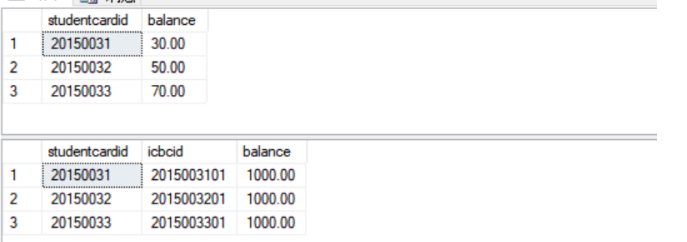

# 二、实验内容

## 1.转账事务

编写一个事务处理实现如下操作，学号为20150032的学生需要从银行卡转账两百元到自己的校园卡中，若过程中出现错误则回滚。

```mssql
set transaction isolation level repeatable read
Begin transaction 
use student
go

declare @x decimal(10,2)
select @x=balance
from icbc_card
where studentcardid='20150032'
set @x=@x-200
if(@x>=0)
  begin
	update icbc_card set balance =@x where studentcardid='20150032'
	update campus_card set balance=balance+200
	where studentcardid='20150032'
	commit tran
 end
else 
  begin 
	print'余额不足，不能转账'
	rollback tran 
  end
```

结果如下:

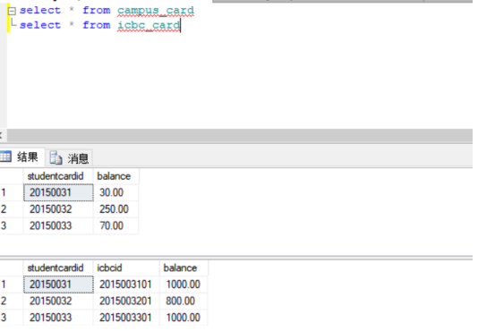

## 2.数据不一致模拟

基于当前数据库STUDENT，涉及样例展示四种数据不一致的问题，丢失修改，读脏数据，不可重复读和幻读(删除和插入).

### 2.1丢失修改

(1)事务一：

```mssql
   Begin tran
	declare @balance decimal(10,2)
	select @balance=balance from campus_card where studentcardid='20150033'
	waitfor delay '00:00:05'
	set @balance=@balance-10 
	update campus_card set @balance=@balance where studentcardid='20150033'
	commit tran
go
select balance from campus_card where studentcardid='20150033'
```

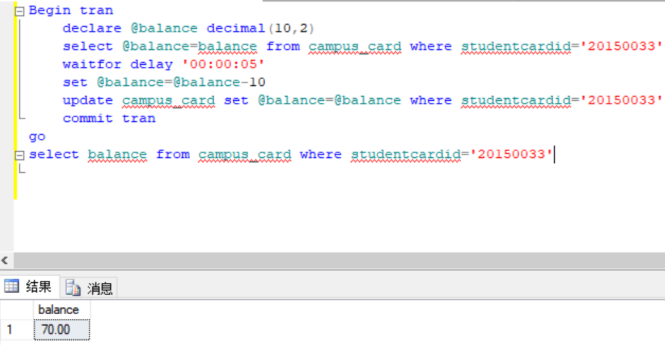

(2)事务二:

```mssql
Begin tran
	declare @balance1 decimal(10,2)
	select @balance1=balance from campus_card where studentcardid='20150033'
	waitfor delay '00:00:05'
	set @balance1=@balance1-20 
	update campus_card set balance=@balance1 where studentcardid='20150033'
	commit tran
go
select balance from campus_card where studentcardid='20150033'
```

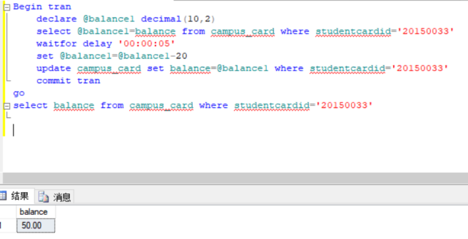

最终事务2的结果覆盖了事务1的更改值，结果并非事务1和事务2叠加修改的预期值40，事务1的更改丢失了，现在结果为50.

### 2.2 读脏数据

(1)事务一:

```mssql
set transaction isolation level read uncommitted 
---read uncommitted执行脏读，不发出共享锁，也不接受排他锁
begin tran
		declare @balance decimal(10,2) 
		select @balance=balance from campus_card where studentcardid='20150032'
		update campus_card set balance=@balance+100 where studentcardid='20150032'
	 	waitfor delay '00:00:05'
		rollback tran
		go
select balance from campus_card where studentcardid='20150032'
```


(2)事务二:

```mssql
set transaction isolation level read uncommitted 
begin tran
		declare @balance decimal(10,2) 
		select @balance=balance from campus_card where studentcardid='20150032'
		update campus_card set balance=@balance+50 where studentcardid='20150032'
		 waitfor delay '00:00:05'
		rollback tran
		go
select balance from campus_card where studentcardid='20150032'
```

事务1更改了数据，事务2读取了表中更改后的值再进行操作，事务1回滚，最终的表存储
了错误结果。

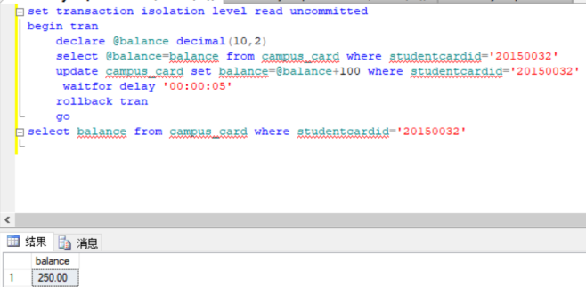

### 2.3不可重复读

(1)事务一:

```mssql
set transaction isolation level read uncommitted 
use student	
go
begin tran
	select balance from campus_card where studentcardid='20150031'
	 waitfor delay '00:00:10'
	 select balance from campus_card where studentcardid='20150031'
	commit tran
```

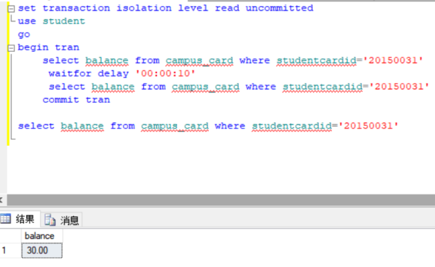

(2)事务二:

```mssql
set transaction isolation level read uncommitted 
use student	
go
begin tran
   	 update campus_card set balance=balance+200 
    	where studentcardid='20150031'
commit tran
```

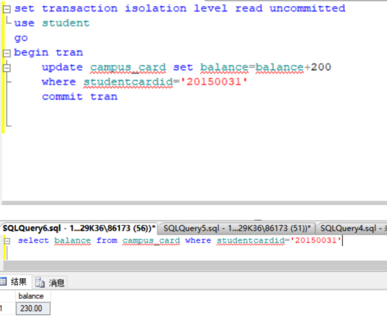

可以看到，事务一读取了数据，事务二更改了数据，事务一再读取数据，事务一两次读取的都不同。

### 2.4 幻读

#### 2.4.1 插入数据

(1)事务一:

```mssql
set transaction isolation level read uncommitted 
begin tran
 use student
 go
 	select balance from campus_card where studentcardid='20150031'
waitfor delay '00:00:05'
select balance from campus_card where studentcardid='20150031'
commit tran
```

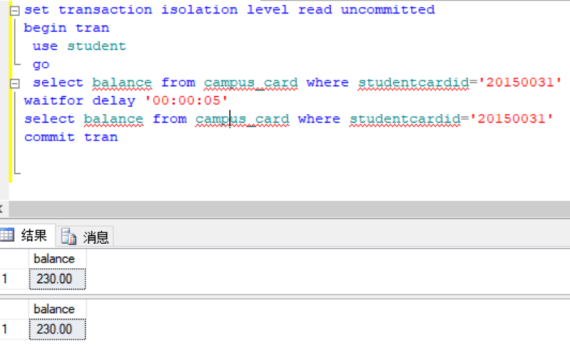

(2)事务二:

```mssql
set transaction isolation level serializable
begin tran
  	insert into campus_card values ('20150031',30)
commit tran
select balance from campus_card where studentcardid='20150031'
```

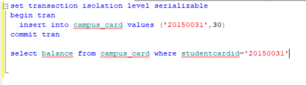

#### 2.4.2 删除数据

(1)事务一:

```mssql
set transaction isolation level read uncommitted 
begin tran
 use student
 go
select balance from campus_card where studentcardid='20150031'
waitfor delay '00:00:05'
select balance from campus_card where studentcardid='20150031'
commit tran
```

(2)事务二:

```mssql
set transaction isolation level repeatable read
begin tran
delete from campus_card where studentcardid='20150031'
select balance from campus_card where studentcardid='20150031'
commit tran
```

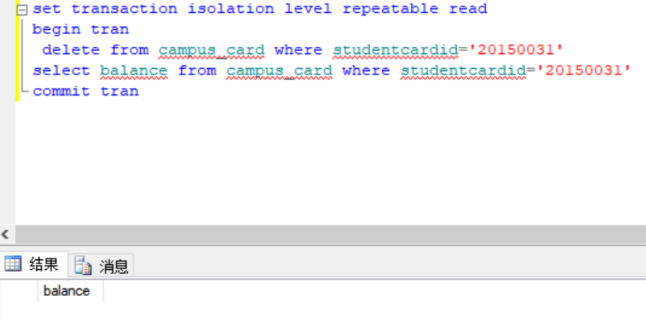

## 3.解决方案

利用锁机、 数据库的隔离级别等知识， 设计方案分别解决上述丢失修改、 读脏数据和不可重复。

读（幻读）的数据不一致问题， 可以用sp_lock过程查看当前锁的状态。

修改隔离级别以确保数据的正确性：

丢失修改， 在SQL 语句前加未提交读：

```
SET TRAN ISOLATION LEVEL READ UNCOMMITTED 
```

读脏数据， 在SQL语句前加已提交读：

```
Set tran isolation level read committed 
```

不可重复读， 在SQL语句前加可重复读：

```
Set tran isolation level repeatable read
```

幻读， 在SQL语句前加可串行读：

```
Set tran isolation level read committed
```

4.构造出现死锁的情况

将锁的级别改为提交可读

```mssql
Set tran isolation level read committed --事务1
Begin tran 
Declare @read int Select @read=grade From sc 
Where sno='95003' Waitfor delay'00:00: 10' Update sc 
Set grade =@read-1 Where sno='95003'
－－事务2
Begin tran 
Declare @read int Select@read=grade From sc 
Where sno='95003' Update sc 
Set grade=@read-1 Where sno='95003'
```

5.利用DBCC log命令可以查看Student数据库的事务日志

```mssql
DBCC LOG('Student',TYPE=2) 
```

